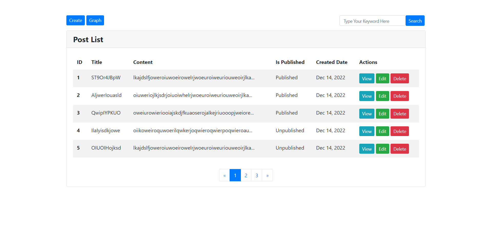
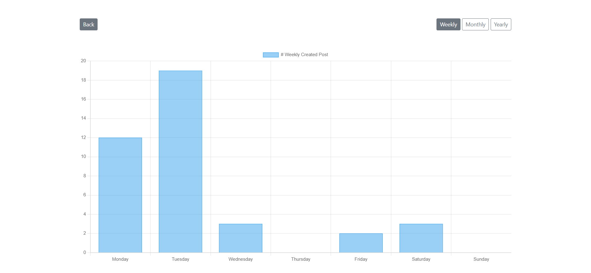
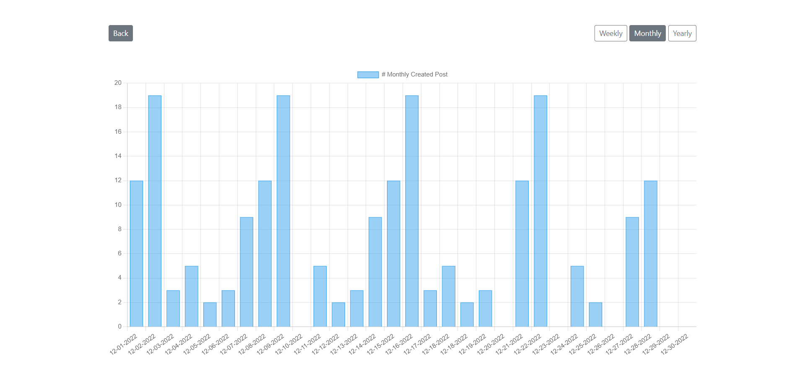
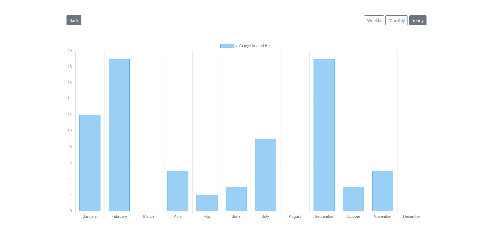

# Tutorial 09

## Show post data with weekly, monthly, yearly graph.

## Folder Structure
```
.
css/
├── reset.css
└── style.css
demo/
└── Tuto_09.png
images/
├── example_01.png
├── example_02.png
└── ...
libs/
index.php
README.md
```

## Index Page Design
;

<hr>

## Weekly Graph Design


<hr>

## Montly Graph Design


<hr>

## Yearly Graph Design

